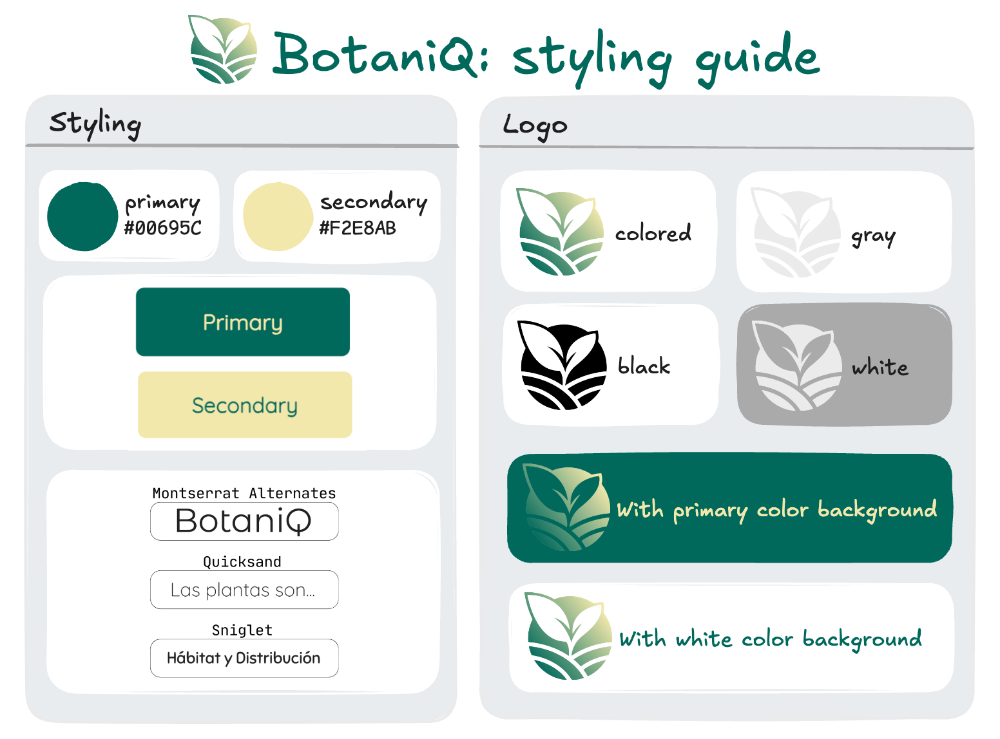

# 🧱 Components & Styling

### Components Library

Every project requires some UI components such as modals, tabs, sidebars, menus, etc. Instead of building those from scratch, you might want to use some of the existing, battle-tested component libraries.

In this project we selected [Prime React](https://primereact.org/), a free and open source UI components library. This library features a wide range of components and a comprehensive documentation with examples, guides and templates.

### Styling Solution

To style the application we selected [Tailwind](https://tailwindcss.com/), whose paradigm is based on the usage of small and reusable CSS classes as building blocks. This tool diminishes the need for custom CSS thus increasing the consistency of the design system across the application. Also, due to its purge support, only used classes are included in the production build therefore reducing the styles size, which is beneficial in environments with slower internet connection.

Tailwind can be integrated with Prime React by using their passthrough API to override the default theme for a custom one. The application theme is defined in the `src/theme.ts` file, if you are customizing a component and want to know which are the customizable elements please consult the `PASS THROUGH` section of the component documentation e.g. [button's documentation](https://primereact.org/button/#pt.wireframe). 

For more information about how the pass through works with Tailwind consult [Prime React's documentation](https://primereact.org/tailwind/). 

### Style Guide

