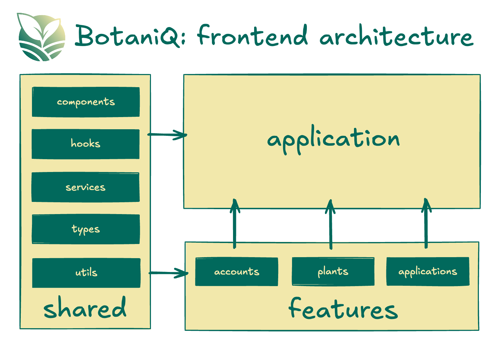

# 🗄️ Project Structure

Most of the application code lives in the `src` folder and looks like this:

```
src/
┣ app/
┃ ┣ pages/  # application pages
┃ ┣ app-container.tsx # container that wraps the entire application with different global providers
┃ ┣ layout/		# layout of the application 
┃ ┗ app.tsx		# main application component
┣ assets/		# assets folder can contain all the static files such as images, fonts, etc.
┣ components/		# shared components used across the entire application (this components should be simple)
┣ config/		# global configurations, exported env variables etc.
┣ features/		# feature based modules
┣ hooks/		 # shared hooks used across the entire application
┣ services/  # shared services accross the entire application e.g. APIs, local storage, messaging
┣ stores/		# global state stores
┣ test/		# test utilities and mocks
┣ types/		# shared types used across the application
┣ utils/ # shared utility functions
```

For easy scalability and maintenance, organize most of the code within the features folder. Each feature folder should contain code specific to that feature, keeping things neatly separated. This approach helps prevent mixing feature-related code with shared components, making it simpler to manage and maintain the codebase compared to having many files in a flat folder structure. By adopting this method, you can enhance collaboration, readability, and scalability in the application's architecture.

A feature could have the following structure:

```sh
src/features/my-feature
┣ services         
┣ assets      
┣ components  
┣ hooks       
┣ stores     
┣ types       
┣ utils       
```

> NOTE: You don't need all of these folders for every feature. Only include the ones that are necessary for the feature.

To make the application less convoluted is preffered for each feature to be independent, if you need to mix features please compose them at the page level. The following diagram illustrates how the architecture should work.



