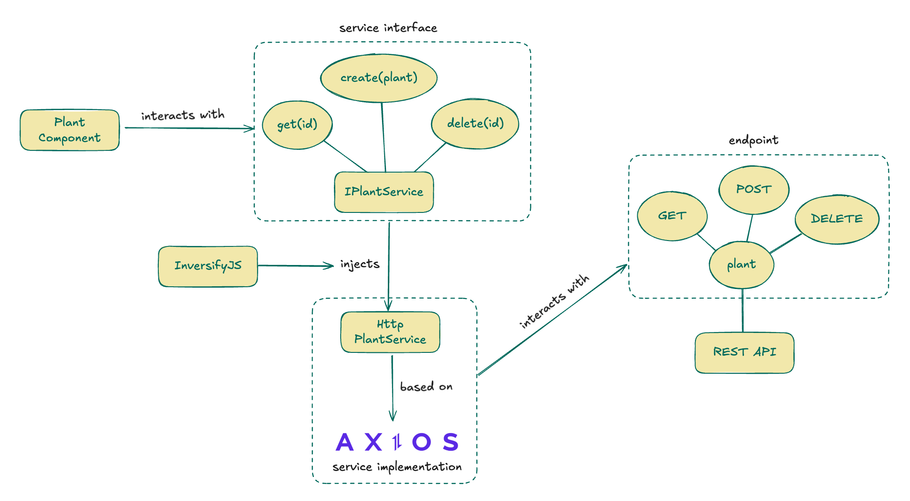

# 📡 Service Layer

The service layer handles the interaction between the features of the application and the service providers. These providers may be internal (e.g. [Toast](https://primereact.org/toast/) message service) or external (e.g. REST API, internal storage). 

## Service Abstraction

Since there might be multiple providers for the same service and we could need to switch between providers we recommend to follow the [SOLID](https://en.wikipedia.org/wiki/SOLID) principles and define interfaces for each one of the services and inject the implementation in running time.

The following diagram illustrates the dependency injection principle for a HTTP REST API service.

For injecting the services into the components we have two possible solutions.

### Context & Providers

In a typical React application, data is passed top-down (parent to child) via props. Context is designed to share data that can be considered “global” (like a service :wink:) for a tree of React components. By using a [Provider](https://legacy.reactjs.org/docs/context.html#contextprovider) component we can pass an object to all of its children down the tree, this approach is specially useful if the service requires the existence of another component like the [Toast message service]().

### Containers & [InversifyJS](https://github.com/inversify/InversifyJS)

An **Inversion of Control (IoC) container** is a tool that automatically manages object creation and dependency injection in an application. Instead of manually creating and wiring up dependencies, the container resolves and provides them where needed.

InversifyJS is a lightweight inversion of control (IoC) container for TypeScript and JavaScript apps allowing us to write OOP code to manage the services. Please register your services in the file `src/services/injection/container.ts`, also notice that this injection could be made dependent of environment variables such if the application is in development or production.

